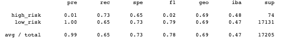
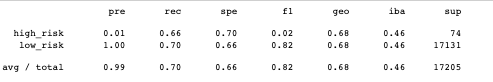
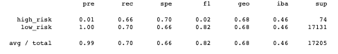
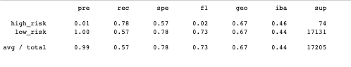
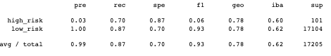
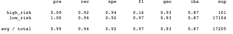

# Credit_Risk_Analysis

## Overview
- I was asked to dive into machine learning (surpervised) to predict credit card risk. In doing this I will be using different models like SMOTE, RandomOverSampler, ClusterCentroids, SMOTEENN and a few others. Below are the results in order to predict the credit risk. 

## Results

## Random Oversampling

ACURRACY: 68.95

PRECISION: High risk is precision is low, low risk is high

RECALL HIGH: 73%

RECALL LOW: 65%

## SMOTE 

ACURRACY:68%

PRECISION:High risk is precision is low, low risk is high

RECALL HIGH: 66%

RECALL LOW: 70%

## Cluster Centroid

ACURRACY:68%

PRECISION:High risk is precision is low, low risk is high

RECALL HIGH:66%

RECALL LOW:70%

##SMOTEENN

ACURRACY: 67.86%

PRECISION: High risk is precision is low, low risk is high
 
RECALL HIGH: 78%

RECALL LOW: 57%

##Balanced Forest Classifier

ACURRACY: 78.85%

PRECISION: High risk is precision is low, low risk is high

RECALL HIGH: 70%

RECALL LOW: 87%

## Easy Ensemble Classifier

ACURRACY: 93.16

PRECISION: High risk is precision is low, low risk is high

RECALL HIGH: 94%

RECALL LOW: 92%

## SUMMARY

After working through these models, it would be my reccomendation that in the future, the Easy Ensemble Classifier be the first one that it tried when testing. THe reason is that this model scored the highest out of the rest of them in accuracy at 93.16%. With an accuracy this high, this might show that the model is superior to the other test. However i beleive that someone should test multiple models because the results can differ. 
